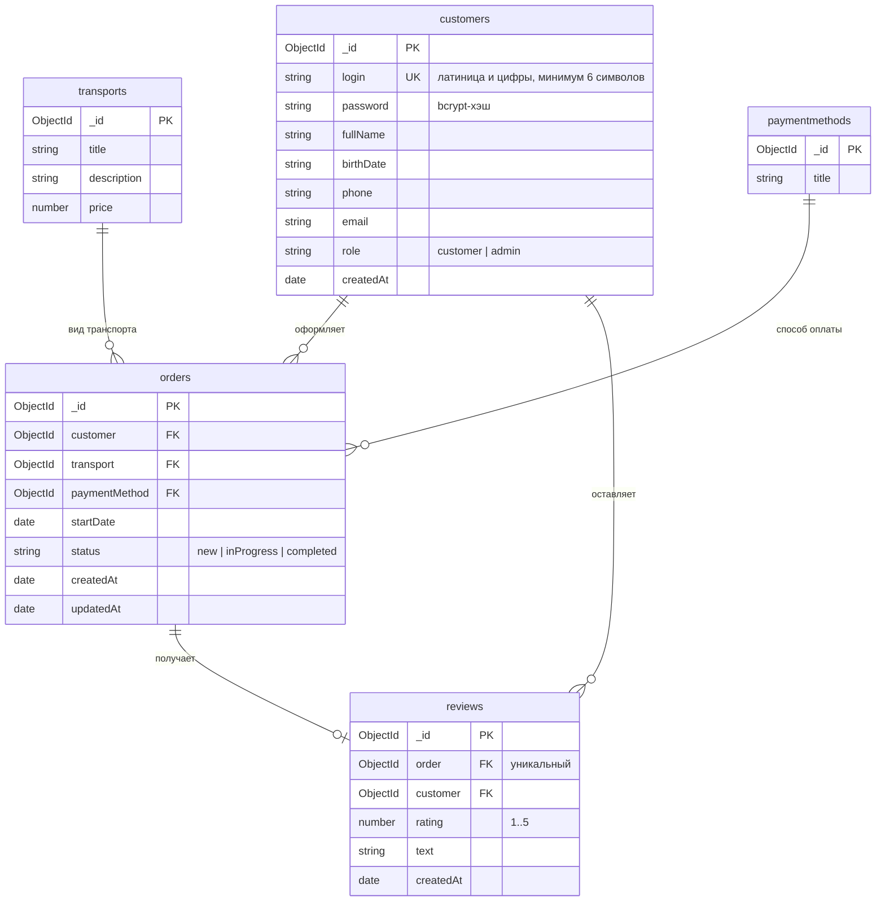

# Водить.РФ

Портал записи на курсы обучения вождению речного транспорта (катер, круизный лайнер, яхта).
Клиент — Vue 3 + Vite + mhz-ui, сервер — Fastify + Mongoose + MongoDB.

## Возможности

- регистрация с валидацией всех полей (логин — латиница и цифры, минимум 6 символов, пароль — от 8 символов);
- вход по паре логин-пароль с информативными уведомлениями об ошибках;
- личный кабинет: слайдер, история заявок, отзыв по завершённой заявке;
- оформление заявки: вид транспорта и способ оплаты из выпадающих списков, дата в формате ДД.ММ.ГГГГ;
- панель администратора: фильтры по статусу и транспорту, поиск, сортировка, постраничная навигация, смена статуса через модальное окно с уведомлениями;
- адаптивная вёрстка (целевое разрешение 390x844) и микроанимации.

## Запуск

```bash
npm install
npm run dev
```

- API: http://127.0.0.1:5000/api
- Клиент: http://localhost:5173

Требуется запущенная MongoDB на `127.0.0.1:27017`. База `driverf` и справочники создаются автоматически при старте сервера.

Скрипты: `npm run dev` (сервер и клиент вместе), `npm run dev:server`, `npm run dev:client`, `npm run ts` (проверка типов сервера и клиента).

## Доступ администратора

Логин `Admin26`, пароль `Demo20` (захардкожены в `server/src/seed.ts`, константы `ADMIN_LOGIN`, `ADMIN_PASSWORD`).
Панель доступна по адресу `/admin` после входа под администратором.

## ER-диаграмма



## API

| Метод | Путь | Доступ | Описание |
| --- | --- | --- | --- |
| POST | `/api/register` | все | регистрация клиента (201, 409 — логин занят) |
| POST | `/api/login` | все | вход (404 — нет логина, 401 — неверный пароль) |
| GET | `/api/me` | авторизованные | текущий пользователь |
| GET | `/api/transports` | все | справочник видов транспорта |
| GET | `/api/payment-methods` | все | справочник способов оплаты |
| POST | `/api/orders` | клиент | создание заявки (статус всегда `new`) |
| GET | `/api/orders?page=&limit=&sort=&dir=&status=&transport=&search=` | авторизованные | клиент — свои заявки, администратор — все, ответ `{ data, total }` |
| PATCH | `/api/orders/:id` | администратор | смена статуса (403 при запрещённом переходе) |
| POST | `/api/reviews` | владелец заявки | отзыв только по заявке со статусом «Обучение завершено», один отзыв на заявку |

Статусы заявки: `new` → «Новая», `inProgress` → «Идет обучение», `completed` → «Обучение завершено».
Разрешённые переходы: `new` → `inProgress` | `completed`, `inProgress` → `completed`.

Авторизация — JWT в заголовке `Authorization: Bearer <token>`, токен хранится в cookie `driverfToken`.

## Структура

```
frontend/                   # Vue 3 + Vite
  src/api/index.ts          # запросы к API
  src/auth/index.ts         # текущий пользователь и токен
  src/components/           # AppHeader, BaseSlider, OrderCard, OrderForm, ReviewForm, StatusModal
  src/constants/index.ts    # переиспользуемые константы приложения
  src/helpers/index.ts      # вспомогательные функции
  src/pages/                # Home, Login, Register, Account, Order, Admin
  src/router/index.ts       # маршруты и защита переходов
  src/styles/main.scss      # темы mhz-ui, адаптив, микроанимации
  src/types/index.ts        # типы данных
backend/                    # Fastify + Mongoose
  src/types.ts              # интерфейсы сущностей Mongoose и payload токена
  src/helpers.ts            # хэширование, валидация, DTO, JWT, переходы статусов
  src/models.ts             # 5 схем Mongoose
  src/routes.ts             # 9 эндпоинтов
  src/seed.ts               # идемпотентное сидирование
  src/index.ts              # сборка приложения и запуск
```
