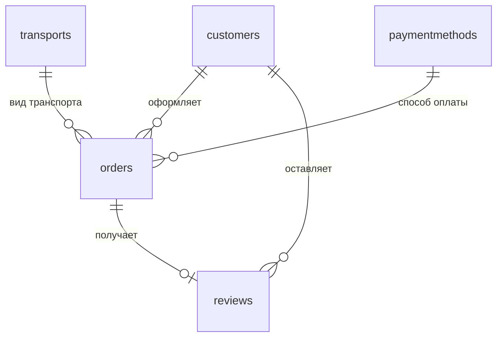

# Implementation Plan

План по ТЗ `tz.txt` — портал «Водить.РФ» (запись на курсы вождения речного транспорта).

## [Overview]

Fullstack-приложение: `client/` (Vue 3.6.0-rc.8 + Vite 8 + mhz-ui/mhz-helpers 1.4.40) и `server/` (Fastify 5 + Mongoose 9 + MongoDB на 127.0.0.1:27017), запуск одной командой `npm run dev`. Реализуются все три модуля ТЗ: M1 — функционал (регистрация с валидацией, вход, личный кабинет, заявка, админка со статусами), M2 — мобильный дизайн под 390x844 (слайдер с автопрокруткой 3 с и стрелками, выпадающие списки, дата ДД.ММ.ГГГГ, фильтры/сортировка/пагинация/модальные окна/toast), M3 — адаптив, микроанимации, качество кода (строгий TS, `vue-tsc` без ошибок).

Курс — на минимальный, легко читаемый код (~30 небольших файлов): 6 файлов сервера, ~19 файлов клиента, 3-4 файла в корне. Плоские функции и Vue SFC, без сервис-слоя, Swagger, TanStack Query и юнит-тестов.

Сидирование при старте сервера: админ `Admin26` / `Demo20` (bcrypt, role `admin`), 3 вида транспорта (катер, круизный лайнер, яхта), 3 способа оплаты (наличные, банковская карта, безналичный перевод).

Подтверждённые решения: 5 коллекций в БД (транспорт и способы оплаты — справочники); админка в том же SPA (маршрут `/admin`); запуск одной командой `npm run dev`; юнит-тесты не пишем; слайдер — свой компонент (`UiSlider` из mhz-ui не умеет автопрокрутку и стрелки); отзыв только для заявки со статусом `completed`, один отзыв на заявку; ER-диаграмма — mermaid в README.

## ER-диаграмма



- customers: \_id, login (unique, /^[a-zA-Z0-9]{6,}$/), password (bcrypt), fullName, birthDate, phone, email, role (customer|admin), createdAt
- transports: \_id, title, description, price
- paymentmethods: \_id, title
- orders: \_id, customer (ref customers), transport (ref transports), paymentMethod (ref paymentmethods), startDate (Date), status (new|inProgress|completed, default new), createdAt, updatedAt
- reviews: \_id, order (ref orders, unique), customer (ref customers), rating (1..5), text, createdAt

## [Types]

`server/src/constants.ts` и `client/src/types.ts` — типы дублируются, общий пакет не создаём:

```ts
type TRole = "customer" | "admin";
type TOrderStatus = "new" | "inProgress" | "completed";

interface ICustomer {
  _id: string;
  login: string;
  fullName: string;
  birthDate: string;
  phone: string;
  email: string;
  role: TRole;
}
interface ITransport {
  _id: string;
  title: string;
  description: string;
  price: number;
}
interface IPaymentMethod {
  _id: string;
  title: string;
}
interface IReview {
  _id: string;
  rating: number;
  text: string;
  createdAt: string;
}
interface IOrder {
  _id: string;
  customer: ICustomer;
  transport: ITransport;
  paymentMethod: IPaymentMethod;
  startDate: string;
  status: TOrderStatus;
  review?: IReview;
}

type TLoginData = {login: string; password: string};
type TRegisterData = {login: string; password: string; fullName: string; birthDate: string; phone: string; email: string};
type TOrderFormData = {transport: string; startDate: string; paymentMethod: string};
type TOrdersReply = {data: IOrder[]; total: number};
```

Константы: `ORDER_STATUS_LABEL`, `ORDER_STATUS_TRANSITIONS` (new -> inProgress | completed; inProgress -> completed; completed -> пусто), `LOGIN_PATTERN`, `PASSWORD_MIN = 8`, `DATE_PATTERN = /^\d{2}\.\d{2}\.\d{4}$/`, `PHONE_PATTERN`, `TOKEN_NAME`, `API_URLS` (пути эндпоинтов), `URLS` (страницы) — URL в коде не хардкодятся.

## [Files]

Корень: `package.json` (workspaces client и server, скрипты `dev`, `dev:server`, `dev:client`, `ts`), `.gitignore`, `README.md`, `implementation_plan.md`.

Сервер (`server/`):

- `package.json`, `tsconfig.json` (allowImportingTsExtensions, noEmit, строгий режим), `.env`, `.env.example` (PORT=5000, DATABASE=driverf, SECRET, ADMIN_LOGIN, ADMIN_PASSWORD).
- `src/index.ts` — Fastify + cors + jwt + mongoose.connect + routes + seed + listen(5000).
- `src/models.ts` — 5 схем Mongoose.
- `src/routes.ts` — 9 эндпоинтов + проверки onlyLoggedIn / onlyCustomer / onlyAdmin.
- `src/seed.ts` — идемпотентное сидирование админа и справочников.
- `src/helpers.ts` — hashPassword, checkPassword, validateRegister, parseRuDate, validateStatusTransition, attachReviews.
- `src/constants.ts` — типы, паттерны, подписи и переходы статусов, пути API.

Клиент (`client/`):

- `package.json`, `vite.config.ts` (alias `@` -> src, порт 5173, sass additionalData `@use "mhz-ui/dist/breakpoints" as *;`), `tsconfig.json`, `index.html`, `env.d.ts`, `.env` (VITE_API=http://localhost:5000/api).
- `public/images/slider/slide-1..4.svg` (заглушки 1200x600), `public/favicon.svg`.
- `src/main.ts`, `src/App.vue`, `src/router.ts`, `src/api.ts` (все запросы через `api` из mhz-helpers), `src/auth.ts` (currentUser, isAuth, isAdmin, cookie-токен), `src/types.ts`, `src/constants.ts`, `src/styles/main.scss` (темы mhz-ui, адаптив, микроанимации).
- `src/components/`: `AppHeader.vue`, `BaseSlider.vue`, `OrderCard.vue`, `OrderForm.vue`, `ReviewForm.vue`, `StatusModal.vue` (IProps/IEmit, CSS Modules `$style`, `.scss`).
- `src/pages/`: `HomePage.vue`, `LoginPage.vue`, `RegisterPage.vue`, `AccountPage.vue`, `OrderPage.vue`, `AdminPage.vue` (вход Admin26/Demo20 и панель заявок на одной странице).

Раскладка клиента — плоская (`src/pages`, `src/components`) ради простоты; те же файлы можно разложить по модулям `src/modules/{auth,order,account,admin,home,common}` без изменения объёма кода.

## [Functions]

Сервер: `buildApp()`, `start()`, `hashPassword(password)`, `checkPassword(password, hash)`, `validateRegister(data)` (паттерн логина, пароль >= 8, обязательные поля, дата/телефон/e-mail), `parseRuDate('12.05.2026')`, `validateStatusTransition(from, to)`, `seedAdmin()`, `seedTransports()`, `seedPaymentMethods()`, `attachReviews(orders)`.

Эндпоинты `/api`: `POST /register` (201 / 409 «Логин уже занят»), `POST /login` (200 {token, user} / 404 «Пользователь с таким логином не найден» / 401 «Неверный пароль»), `GET /me`, `GET /transports`, `GET /payment-methods`, `POST /orders` (только клиент, статус всегда new), `GET /orders?page=&limit=5&sort=&dir=&status=&transport=&search=` (клиент — свои, админ — все, ответ `{data, total}`), `PATCH /orders/:id` (только админ, 403 при запрещённом переходе), `POST /reviews` (только владелец заявки и только при статусе completed, повтор — 409).

Клиент: одна функция-действие на компонент (`submitRegister`, `submitLogin`, `submitOrder`, `openStatusModal`, `confirmStatus`, `applyFilters`, `changePage`, `sortBy`, `saveReview`) + `showNextSlide`, `showPreviousSlide`, `goToSlide`, `startAutoSlide`, `stopAutoSlide`. Валидация — `useValidate(formData, rules, 'ru')` с `required/letters/min/max/email` и кастомными паттернами, ошибки в `UiField error`, уведомления — `toast` из mhz-ui.

## [Classes]

Классов нет. Роль классов: модели Mongoose как фабрики (`model<ICustomer>('Customer', customerSchema)`), Vue SFC с `defineProps<IProps>()` / `defineEmits<IEmit>()`, состояние пользователя — один `ref` в `auth.ts` (Pinia не нужна).

## [Dependencies]

Версии сверены через npm registry:

- Корень (dev): `concurrently@10.0.5` — единственный новый пакет (для `npm run dev`).
- server: `fastify@5.12.5`, `@fastify/cors@11.3.0`, `@fastify/jwt@10.2.2`, `mongoose@9.10.2`, `bcryptjs@3.0.3`, `dotenv@18.0.3`; dev: `typescript@6.0.3`, `@types/node@26.6.2`.
- client: `vue@3.6.0-rc.8`, `vue-router@5.3.1`, `mhz-ui@1.4.40`, `mhz-helpers@1.4.40`; dev: `vite@8.3.1`, `@vitejs/plugin-vue@6.0.9`, `vue-tsc@3.3.11`, `sass-embedded@1.105.0`, `typescript@6.0.3`, `@types/node@26.6.2`.

Новые пакеты не добавляются без согласования. Сервер исполняется нативно на Node 25 (`node --watch src/index.ts`, type stripping) — импорты с расширением `.ts`, без `enum`/`namespace`. Vue Router 5 не имеет breaking changes относительно v4.

## [Testing]

Юнит-тесты не пишем (согласовано). Проверка: `npm install` -> `npm run ts` (`tsc --noEmit` на сервере, `vue-tsc --noEmit` на клиенте, 0 ошибок) -> `npm run dev` -> ручной смоук в браузере: регистрация (неверные данные — подсказки, верные — 201), вход с неверным паролем (уведомление), оформление заявки (выпадающие списки, дата ДД.ММ.ГГГГ), вход админом Admin26/Demo20, фильтры/сортировка/пагинация/смена статуса через модалку + toast, отзыв в кабинете (скрыт до статуса «Обучение завершено»), слайдер (3 с, стрелки, точки), вид 390x844, пустая консоль. Дополнительно проверяются 5 коллекций и сидированные данные в MongoDB.

## [Implementation Order]

1. `git init`, `.gitignore`, корневой `package.json`, `README.md` с ER-диаграммой, `implementation_plan.md`.
2. Сервер: конфиги, `constants.ts`, `helpers.ts`, `models.ts`, `seed.ts`, `routes.ts`, `index.ts`; проверка API через Invoke-RestMethod -> коммит 1 `feat: backend — модели MongoDB, регистрация/вход, заявки, отзывы, админские фильтры`.
3. Клиент, каркас: `main.ts`, `App.vue`, `router.ts`, `api.ts`, `auth.ts`, `types.ts`, `constants.ts`, `styles/main.scss`, `AppHeader.vue`, `BaseSlider.vue` + 4 картинки.
4. Клиент: `HomePage`, `LoginPage`, `RegisterPage`, `AccountPage` -> коммит 2 `feat: главная со слайдером, регистрация, вход, личный кабинет`.
5. Клиент: `OrderPage` (+`OrderForm`), `AdminPage` (+`StatusModal`, `OrderCard`, `ReviewForm`) -> коммит 3 `feat: оформление заявки и панель администратора`.
6. Адаптив 390x844 + микроанимации + итоговые `npm run ts` и смоук -> коммит 4 `style: мобильная адаптация и микроанимации`.
